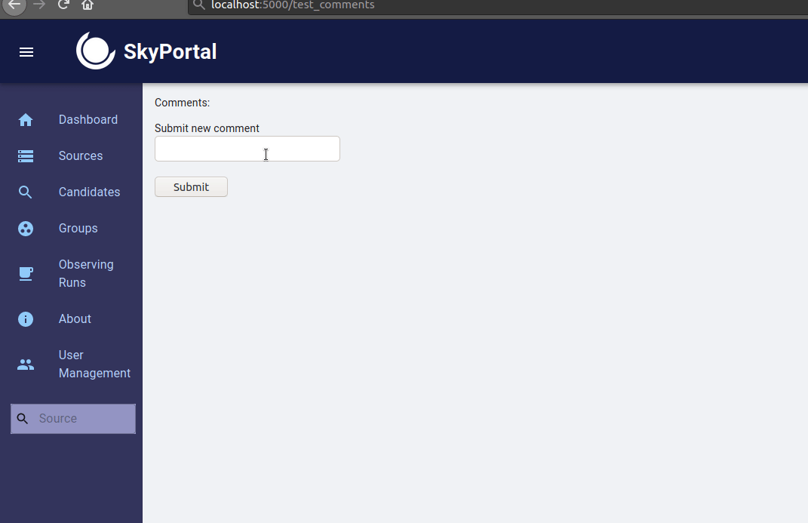

# Adding new features

This section will help you get started adding new features to SkyPortal. We'll discuss the application structure and data flow, and introduce some of the main technologies that are employed, outlining their basic usage. We'll dig into the code base by walking through the process of adding a simple new feature: a button that triggers an API call to the back-end, which generates a random string that is displayed in the browser.

## Front-end overview: React & Redux

The SkyPortal front-end uses React, a component-based UI library, in conjunction with Redux, a front-end state-management library. See the following links for introductory tutorials to these and related libraries, from which much of the below is drawn:

[ReactJS Tutorial](https://reactjs.org/tutorial/tutorial.html)

[ReactJS Hooks Overview](https://reactjs.org/docs/hooks-overview.html)

[Redux Tutorial](https://redux.js.org/basics/basic-tutorial/)

[React-Redux Hooks Intro](https://react-redux.js.org/next/api/hooks)

### Basic React concepts: Elements and Components

In React, [_elements_](https://reactjs.org/docs/rendering-elements.html) are the smallest building blocks of an app and correspond to DOM elements, but are simple JavaScript objects that are cheap to create. Elements describe what should be displayed in the browser. Here's a simple example of an element (written with a [JSX](https://reactjs.org/docs/introducing-jsx.html) tag):

``` jsx
const element = <h1>Hello, world</h1>;
```

[_Components_](https://reactjs.org/docs/components-and-props.html) are essentially pure JavaScript functions that take inputs (called "props") and return elements. Let's look at a simple example:

``` jsx
const Component = () => {
  return <h1>Hello, world</h1>;
};
```

As you can see, our component is simply a function (written above as an ES6 [arrow function](https://developer.mozilla.org/en-US/docs/Web/JavaScript/Reference/Functions/Arrow_functions)) that returns an element. If arrow functions look unfamiliar, the above component definition is equivalent to:

``` jsx
function Component() {
  return <h1>Hello, world</h1>;
}
```

Components can be defined as classes or functions, but in this tutorial we'll always use the functional form. As noted above, components can take inputs, called props. Let's take a look at a simple component that takes a single "props" argument `name`:

``` jsx
const Component = (props) => {
  return (
    <h1>
      Hello, {props.name}
    </h1>
  );
};
```

This component returns an element, that, when rendered into the DOM (more on this below), displays a header containing the text "Hello, Maria" (assuming we passed in `name='Maria'`). Inside [JSX](https://reactjs.org/docs/introducing-jsx.html) tags, JavaScript expressions must be wrapped in curly braces, as `props.name` is above. If we instantiate this component and pass in the value 'world' to the `name` prop, the resulting value is identical to the first element we defined above:

``` jsx
const helloWorldElement = <Component name="world" />;
```
is identical to:
``` jsx
const helloWorldElement = <h1>Hello, world</h1>;
```

Note that React component names should always be capitalized, as React looks for this to distinguish component tags (e.g. `<Component />`) from DOM tags (e.g. `<div>...</div>`).

Now we know a bit about React elements and components, but we still haven't actually rendered anything into the DOM. To render a React element into a DOM node, we pass both into `ReactDOM.render()` Let's look at a full example:

``` jsx
import React from 'react';
import ReactDOM from 'react-dom';


// Define our component:
const Component = (props) => (
  <h1>
    Hello, {props.name}
  </h1>
);

// Render the element it returns into the DOM (into the DOM element with ID "root"):
ReactDOM.render(<Component name="world" />, document.getElementById("root"));
```

We define our component, then pass an instance of that component (which evaluates to a React element) as the first argument to `ReactDOM.render()`, and pass the DOM element that we want to render our element into as the second argument. (Note that in the above component definition, we're using an [arrow function with a "concise body" implicit return](https://developer.mozilla.org/en-US/docs/Web/JavaScript/Reference/Functions/Arrow_functions#Function_body).)

Components can also render other components, as in the following example:

``` jsx
const Welcome = (props) => (
  <h1>Welcome, {props.name}</h1>
);

const HomePage = () => (
  <div>
    <Welcome name="Maria" />
    <Welcome name="Sofia" />
    <Welcome name="Li" />
  </div>
);

ReactDOM.render(<HomePage />, document.getElementById("root"));
```

This renders a `div` containing our three welcome headers into the DOM element whose ID is "root".

### Component state

Components can have their own internal state, independent of the props that are passed into them. To illustrate, let's create a component that tracks how many times a button has been clicked, and displays the count.

For functional components, we use React's [`useState` hook](https://reactjs.org/docs/hooks-overview.html) to create a state object and a function that updates it. Let's first just define a component with some state that displays the value of that state:

``` jsx
import React, { useState } from 'react';


const Counter = () => {
  const [count, updateCount] = useState(0);

   return (
     <div>
       Current count: {count}
     </div>
  );
};
```
We pass in `0` as the default value to `useState`, which returns a tuple containing our state object (which we've called `count`) and a function that can update that state (which we've called `updateCount`). So now we have a component that has its own state and displays that value in a `div`, but that isn't very useful because we have no way of interacting with it to update that value. Let's define a handler to update the count, add a button, and pass our handler to the `onClick` event in the button:

``` jsx
import React, { useState } from 'react';


const Counter = () => {
  const [count, updateCount] = useState(0);

  const handleClick = () => {
    const newCount = count + 1;
    updateCount(newCount);
  };

   return (
     <div>
       <div>
         Current count: {count}
       </div>
       <div>
         <button type="button" onClick={handleClick}>
           Increment!
         </button>
       </div>
     </div>
  );
};
```

Let's look at what's happening here: we've defined a new function in our component called `handleClick` that increments the value of our `count` state by 1, and have passed that as a callback to the button's `onClick` event. Now every time we click the button, `handleClick` will be executed which will increment the value of `count` by 1. React tracks whenever a component's props or state are updated, and updates the elements being rendered into the DOM accordingly. Great, our first interactive component with its own state is working! Now that we've learned some of the basics of React, let's take a look at Redux, another front-end library employed in our application.

### Redux basics

We use [Redux](https://redux.js.org/basics/basic-tutorial/) to store and manage global front-end state. The basic idea is simple: Redux provides a global `store` object that contains the application state and allows that state to be updated via the dispatching of _actions_. Actions are simply objects with a `type` attribute and may contain a payload, e.g. `{ type: 'UPDATE_SOURCES', data: { sourceList: [{ id: '14gqr', ... }, ...] }}`. We dispatch actions via the Redux function `store.dispatch`, and these actions are handled by _reducers_ which specify how the application state should be updated in response to actions dispatched to the store. Let's take a look at an example of creating actions and reducers:

``` jsx
// Define our action type:
const UPDATE_SOURCES = "UPDATE_SOURCES";

// Define our reducer:
const reducer = (state = { sourceList: [] }, action) => {
  switch (action.type) {
    case UPDATE_SOURCES: {
      const { sourceList } = action.data;  // Object destructuring assignment
      return {
        ...state,  // Object spread operator
        sourceList  // Object literal property shorthand
      };
    }
    default:
      return state;
  }
};
```

(If the above JavaScript syntax is unfamiliar, please refer to the [object destructuring assignment docs](https://developer.mozilla.org/en-US/docs/Web/JavaScript/Reference/Operators/Destructuring_assignment), [object spread syntax docs](https://tc39.es/proposal-object-rest-spread/), and a description here of [object literal property shorthand](https://developer.mozilla.org/en-US/docs/Web/JavaScript/Reference/Operators/Object_initializer).) Let's break this down: we've defined our action type, which is just a string literal, and assigned its value to the constant `UPDATE_SOURCES`. We also defined a reducer (the function named `reducer`) which takes two arguments: `state`, the current state value (which we've given a default value of `{ sourceList: [] }` here) and `action`, the action object that has been dispatched to the store. Our reducer then returns a new object (or the original state object, described below) based on the previous state and the data contained in `action`. As you can see, the original state is returned with no changes by default, which is the case whenever an action is dispatched whose type doesn't match any of the cases we've described in our reducer. _Reducers are pure functions that take the current state and an action as arguments, and return a new state object_. Whenever an action is dispatched, each of the reducers in the store is called, with the current state and the action passed in as arguments, and only those reducers whose cases match the action type will return a modified state object.

In SkyPortal, we've added a utility method to the global `store` object to inject reducers to the store. Each reducer corresponds to its own branch of the state tree, which is specified when we inject the reducer into the store. Let's look at an example, assuming we're creating new a file in the `static/js/ducks` directory (our `store` is defined in `static/js/store.js`):

``` jsx
import store from '../store';


// Define our action type:
const UPDATE_SOURCES = "UPDATE_SOURCES";

// Define our reducer:
const reducer = (state = { sourceList: [] }, action) => {
  switch (action.type) {
    case UPDATE_SOURCES: {
      const { sourceList } = action.data;
      return {
        ...state,
        sourceList
      };
    }
    default:
      return state;
  }
};

// Inject our reducer into the store, mapping it to the 'sources' state branch:
store.injectReducer('sources', reducer);
```

This warrants a brief note on code organization: we bundle all of our Redux-related code (action types, action creators, reducer) associated with a particular branch of the application state together in a file in the `static/js/ducks` directory ([read more about "ducks" modules here](https://github.com/erikras/ducks-modular-redux)). Each component definition typically goes in its own file in `static/js/components`.

Now that we've added our reducer to the store, whenever an action of type `UPDATE_SOURCES` is dispatched, our reducer will update the `sources` branch of the application state as specified. So far, our global application state looks like: `{ sources: { sourceList: ...} }`.

We have injected our reducer into the store that can handle actions of the type `UPDATE_SOURCES`, so now let's dispatch one. We use the `react-redux` library which provides a `useDispatch` function, giving us access to the store's dispatch. Dispatching an action is as simple as:

``` jsx
import { useDispatch } from 'react-redux';


const dispatch = useDispatch();

const newSourceList = resultFromSomeAPICall();

dispatch({ type: 'UPDATE_SOURCES', data: { sourceList: newSourceList } });
```

The store dispatches the action, and applies each of our reducers to it, creating a new state object from the return values of our reducers (each reducer returning the branch of state it's associated with, e.g. the return value of the reducer above corresponds to the 'sources' branch, or `state.sources`, as specified in our `store.injectRecuer` call). Typically we define _action creators_, functions that return action objects, and call those inside `dispatch` rather than explicitly pass in these clunky action objects everytime we need to dispatch an action. Here's an example of an action creator being defined, and then using it to dispatch an action:

``` jsx
// Define action creator
const updateSources = (newSourceList) => {
  return { type: 'UPDATE_SOURCES', data: { sourceList: newSourceList } };
};

// Get some data
const newSourceList = resultFromSomeAPICall();

// Dispatch an action containing data from above
dispatch(updateSources(newSourceList));
```

We'll often dispatch actions when users submit data, click a button, or if a websocket message is received from the back-end (more on this later) telling the front-end that the DB has been updated and it should re-fetch some data (we always want the relevant portions of the front-end state to stay in sync with the back-end DB).

A typical pattern you will see in SkyPortal is: make an API call (an HTTP request) to fetch data from the back-end, then dispatch an action containing the response data to update the front-end state accordingly. We've written a utility function in `static/js/API.js` that simplifies the process, utilizing [_thunks_](https://github.com/reduxjs/redux-thunk).

From [https://alligator.io/redux/redux-thunk/](https://alligator.io/redux/redux-thunk/):
> Redux Thunk is a middleware that lets you call action creators that return a function instead of an action object. That function receives the store’s dispatch method, which is then used to dispatch regular synchronous actions inside the body of the function once the asynchronous operations have completed.

The function that the action creator returns is a thunk, to which the `redux-thunk` middleware library suppies the store's dispatch. We can then execute some statements inside the thunk, including making API calls to the back-end, and then dispatch an action containing the result. Let's illustrate with an example. Here's a typical SkyPortal action creator (this is a simplified version of part of the actual source code):

``` jsx
import * as API from '../API';


// Action type
export const FETCH_SOURCES = 'skyportal/FETCH_SOURCES';

// Action creator that returns a thunk
export function fetchSources() {
  return API.GET('/api/sources', FETCH_SOURCES);
}
```

When we call `dispatch(fetchSources())`, the thunk returned by `API.GET` is called, which dispatches an action of type `FETCH_SOURCES`, then makes an asynchronous HTTP GET request to the back-end. If the request returns with a successful response, the response data is then packaged into another action of type "FETCH_SOURCES_OK" which is then dispatched to the store. The first action dispatched, of type `FETCH_SOURCES`, may or may not need to be handled in our reducers. In the case of SkyPortal, we do indeed handle this action and update the front-end state object `sources.queryInProgress` in our reducer. The final action dispatched, of type "FETCH_SOURCES_OK", which contains the HTTP request response data, is also handled in our reducer, updating other portions of the `sources` branch of the app state.

In order for our components to access the application state, the `react-redux` library provides the `useSelector` hook:

``` jsx
import { useSelector } from 'react-redux';

// Accessing the application state
const { sourceList } = useSelector((state) => state.sources);
```

Now that we've learned a bit about the various technologies employed in the front-end, let's learn by getting our hands dirty and add a dummy feature to SkyPortal.

## Adding a new end-to-end SkyPortal feature

Now we'll put all these pieces together and walk through adding a new "feature" to SkyPortal: a simple comments section.

### Front-end

We'll start with defining our new `TestComments` component in a new file in the components directory (`static/js/components/TestComments.jsx`):

``` jsx
import React, { useState, useEffect } from 'react';
import { useDispatch, useSelector } from 'react-redux';

// Import our action creators from static/js/ducks/testComments.js - see below
import * as commentsActions from '../ducks/testComments';


const TestComments = () => {
  const comments = useSelector((state) => state.testComments);
  const dispatch = useDispatch();
  const [newCommentText, setNewCommentText] = useState("");

  // Fetch comments upon initial component render
  useEffect(() => {
    dispatch(commentsActions.fetchComments());
  }, [dispatch]);

  // Define text input field's onChange callback
  const handleCommentTextChange = (event) => {
    setNewCommentText(event.target.value);
  };

  // Define submission callback
  const handleSubmitNewComment = async () => {
    const requestResult = await dispatch(commentsActions.submitComment(newCommentText));
    if (requestResult.status === "success") {
      setNewCommentText("");
    }
  };

  return (
    <div>
      <div>
        Comments:
        <ul>
          {comments.map((comment, idx) => (
            <li key={idx}>
              {comment.text}
            </li>
           ))}
        </ul>
      </div>
      <div>
        Submit new comment
        <br />
        <input
          type="text"
          value={newCommentText}
          onChange={handleCommentTextChange}
          data-testid="testCommentInput"
        />
        <br />
        <button
          type="button"
          onClick={handleSubmitNewComment}
          data-testid="testCommentSubmitButton"
        >
          Submit
        </button>
      </div>
    </div>
  );
};

export default TestComments;
```

Inside the component definition we call the `useState` (for maintaining internal component state, here corresponding to the new comment text value), `useDispatch` (for dispatching action creators) and `useSelector` (for accessing the application-wide state) hooks introduced above, and we also make use of the [`useEffect` hook](https://reactjs.org/docs/hooks-effect.html), which executes the function provided as the first argument whenever the values of any of the variables of the second argument (the "dependency array") change. In this case, `dispatch` will not change after the component's initial render, so the function we've provided as the first argument will be called only at that time, and not during re-renders.

Below the hooks calls, we define two functions that serve as callbacks for the event listeners of the `input` and `button` elements. The associated [`event`](https://developer.mozilla.org/en-US/docs/web/api/event) instance is passed as an argument to each callback, which we've made use of in the `handleCommentTextChange` callback by setting the component's state to the newly entered input element's (the event's target) value, accessed via the `value` attribute of [`event.target`](https://developer.mozilla.org/en-US/docs/Web/API/Event/target).

Note that we typically use the [React Hook Form](https://react-hook-form.com)
package for tracking form state and handling validation and submission (slightly
beyond the scope of this introduction). For forms that have dynamically-generated
fields, we use
[`react-jsonschema-form`](https://react-jsonschema-form.readthedocs.io/en/latest/).

The comments in the list `state.testComments` (which is intialized to an empty list in its associated reducer, which we'll see shortly) are rendered, as well as a text input field and submit button for adding new comments. We've provided callback functions to the text input field's and button's `onChange` and `onClick` events, respectively. `handleCommentTextChange` updates the component's state with the newly input value on each keystroke. `handleSubmitNewComment` dispatches an action creator with the new comment text value, and if the request returns successfully, resets the input value to an empty string. This is an example of a [controlled component](https://reactjs.org/docs/forms.html#controlled-components), in which a component's value is passed in as an externally-controlled variable. The `data-testid` attributes are specified to facilitate testing (more on that later). Let's look at the action creators defined below.

All of the redux-related logic associated with our new component will live in a separate file in the `static/js/ducks` directory. This is where we'll define our action types, action creators and reducer.

`static/js/ducks/testComments.js`:
``` jsx
import messageHandler from "baselayer/MessageHandler";

import * as API from '../API';
import store from '../store';


const FETCH_TEST_COMMENTS = 'skyportal/FETCH_TEST_COMMENTS';
const FETCH_TEST_COMMENTS_OK = 'skyportal/FETCH_TEST_COMMENTS_OK';

const SUBMIT_TEST_COMMENT = 'skyportal/SUBMIT_TEST_COMMENT';

export function fetchComments() {
  return API.GET('/api/test_comments', FETCH_TEST_COMMENTS);
}

export function submitComment(commentText) {
  return API.POST('/api/test_comments', SUBMIT_TEST_COMMENT, { commentText });
}

// Websocket message handler
messageHandler.add((actionType, payload, dispatch) => {
  if (actionType === FETCH_TEST_COMMENTS) {
    dispatch(fetchComments());
  }
});

const reducer = (state=[], action) => {
  switch (action.type) {
    case FETCH_TEST_COMMENTS_OK: {
      return action.data;
    }
    default:
      return state;
  }
};

store.injectReducer('testComments', reducer);
```

This defines a few new action types, two new action creators (in this case, functions that return a thunk (another function), which is what `API.GET` and `API.POST` are), and a reducer, which, upon injecting into the store, describes how the `comments` branch of the app state should be updated if an action of type `FETCH_COMMENTS_OK` is received. Note that in addition to dispatching actions of type `"ORIGINAL_ACTION_TYPE" + "_OK"` upon successful completion of API calls, the `API` module functions will also dispatch actions of type `"ORIGINAL_ACTION_TYPE" + "_FAIL"` if the API call fails, which can be handled accordingly in the reducer.

We've also imported `messageHandler` from `baselayer` and called `messageHandler.add`, passing in a function that dispatches an action any time a websocket message is received with an action type of `"skyportal/FETCH_TEST_COMMENTS"`. This will allow the front-end state to stay in sync with the database state; whenever the back-end pushes a websocket message with this action type, the front-end will re-fetch the comments list from the back-end. This is a typical usage pattern when a record is created, changed or deleted. We'll discuss sending websocket messages and front-end message handlers in more detail below.

To render our new `TestComments` component, we can simply import it and render it in the body of any other component being rendered in our app (depending on where we want it to appear): `<TestComments />`. If our component took props (arguments), this is where we'd pass them in. Alternatively, if it is desired that a component be on its own page and associated with its own URL endpoint, this can be accomplished by adding a mapping entry to the `app.routes` section of config.yaml (after you've copied config.yaml.defaults to config.yaml and modified accordingly). See [config.yaml.defaults](https://github.com/skyportal/skyportal/blob/master/config.yaml.defaults) for examples. These are later passed to [`react-router`](https://github.com/ReactTraining/react-router), which maps URL endpoints to React components. For the purposes of this exercise, let's add the following lines to config.yaml under `app.routes`:

``` yaml
    - path: "/test_comments"
      component: TestComments
```

Then, after running the app (instructions to follow), we can navigate to `<base_url>/test_comments` in the browser and see our new component rendered there.

### Back-end

Now let's take a look at what we'll need to add to the back-end to make our new feature work.

The SkyPortal back-end is built using [Tornado](https://www.tornadoweb.org/en/stable/), a Python web application framework that provides its own I/O event loop for non-blocking sockets, making it ideal for use with websockets (see below).

To handle HTTP requests, we define _request handlers_ that are mapped to API endpoints in the application's configuration (in `skyportal/app_server.py` -- see below). Each SkyPortal request handler is a subclass of `BaseHandler` (defined in `skyportal/handlers/base.py`), a handler that extends Tornado's base [RequestHandler](https://www.tornadoweb.org/en/stable/web.html#tornado.web.RequestHandler), handling authentication and providing utility methods for pushing websocket messages to the front-end and returning HTTP responses.

Let's take a look at adding our own handler. We'll start by defining a new request handler in a new file `skyportal/handlers/api/test_comment.py`. Note that we've imported `BaseHandler` which serves as the base class of our new handler. We define class methods describing how to handle requests of various types, e.g. a `put` method for PUT requests, a `post` method for POST requests, etc.


`skyportal/handlers/api/test_comment.py`:
``` python
from baselayer.app.access import auth_or_token
from ..base import BaseHandler
from ...models import DBSession, TestComment


class TestCommentHandler(BaseHandler):
    @auth_or_token
    def get(self):
        # If we wanted to do any query filtering, this is where that would happen
        comments = DBSession().query(TestComment).all()
        return self.success(data=comments)

    @auth_or_token
    def post(self):
        data = self.get_json()
        comment_text = data.get("commentText")
        if comment_text is None or comment_text == "":
            return self.error("`commentText` must be provided as a non-empty string")
        DBSession().add(
            TestComment(user_id=self.current_user.id, text=comment_text)
        )
        DBSession().commit()
        self.push_all(action="skyportal/FETCH_TEST_COMMENTS")
        return self.success()
```

From `skyportal/models.py` we've imported `DBSession`, a [SQLAlchemy](https://docs.sqlalchemy.org/en/13/index.html) [Session](https://docs.sqlalchemy.org/en/13/orm/session.html) instance, and `TestComment`, our SQLAlchemy [mapper class](https://docs.sqlalchemy.org/en/13/orm/mapping_styles.html#declarative-mapping) (which maps a Python class to a database table). We'll see how to define mapper classes (which correspond to database tables) shortly. The decorator `@auth_or_token` tells the application that the request must either come from a logged in user (via the browser), or must include a valid token in the request header. If neither of these are true, the request returns with an error.

In our GET handler (the `get` method), we retrieve all test comments from the database with `DBSession().query(TestComment).all()`. We then return a call to `BaseHandler.success`, which generates a response object whose JSON body content is of the form:

``` python
{
    'status': 'success',
    'version': "SkyPortal version string",
    'data': data,
}
```

where `data` is whatever was passed in as the `data` argument to `success` (the comments list, in this case). `BaseHandler.success` converts `data` to JSON form.

In addition to `success`, `BaseHandler` also provides an `error` method for returning error responses:

``` python
class SomeHandler(BaseHandler):
    def some_request_type(self):
        ...
        if error_occurred:
            return self.error("Error message here")
        else:
            return self.success(...)
```

Error responses with informative messages should be returned when a request contains invalid data, if the user doesn't have access to the requested resource, or if an exception is caught during the handling of the request. The default status code for `BaseHandler.error` is 400, but can be changed accordingly by passing in, for example, `status=404`.

In our POST handler, we access the request's JSON body with `self.get_json()`, and ensure that `"commentText"` is provided there as a non-empty string, returning an error response otherwise. We then insert a new row into the test comments table with `DBSession().add(TestComment(...))`, and commit it to disk with `DBSession().commit()`. Before returning a success response, we call `BaseHandler.push_all`, passing in `action="skyportal/FETCH_TEST_COMMENTS"`, which pushes a websocket message with the specified action type to all currently logged in users. If we wanted to push a websocket message only to the current user (the user who initiated the request currently being handled), we could use `self.push` instead of `self.push_all`.

Let's turn for a moment to [SQLAlchemy](https://docs.sqlalchemy.org/en/13/index.html), a Python library offering a SQL toolkit and object relational mapper (ORM). We [declare classes](https://docs.sqlalchemy.org/en/14/orm/mapping_styles.html#orm-declarative-mapping) that inherit from SQLAlchemy's `declarative_base` (this is all set up in [`baselayer`](https://github.com/cesium-ml/baselayer)'s [`models`](https://github.com/cesium-ml/baselayer/blob/master/app/models.py) module, which we import in SkyPortal's `models` module as `Base`) that are then mapped to database tables by SQLAlchemy. `baselayer`'s base class, which SkyPortal mapper classes inherit from, already comes with a few columns: `id` (integer), `created_at` (`DateTime`), and `modified` (`DateTime`).

With that, let's define our `TestComment` mapper class in `skyportal/models.py`:

``` python
class TestComment(Base):
    text = sa.Column(sa.String, nullable=False, doc="Comment text")
    user_id = sa.Column(
        sa.ForeignKey("users.id", ondelete="CASCADE"),
        nullable=False,
        index=True,
        doc="ID of the User that submitted the comment",
    )
```

The SQLAlchemy ORM maps this class to a database table with the columns `text` (a string type, as specified by `sa.String`) and `user_id` (a [`ForeignKey`](https://docs.sqlalchemy.org/en/14/core/constraints.html#sqlalchemy.schema.ForeignKey) instance, which defines a dependency on the `id` column of the `users` table, constraining the value to a valid user ID), in addition to the above-mentioned columns inherited from `Base`. Note that class names map to table names by appending an "s" (to indicate plurality) to the lowercase version of the class name (e.g. the `User` class maps to the `"users"` table).

As illustrated in our `TestCommentHandler.post` implementation above, class instances map to rows in the corresponding table. So to add a new row to the `"testcomments"` table, we pass an instance of `TestComment` to `DBSession().add`: `DBSession().add(TestComment(text=text, user_id=user_id))`, followed by committing the changes to disk by calling `DBSession().commit()`.

After adding the relevant import lines to `skyportal/handlers/api/__init__.py` and `skyportal/app_server.py` to import our new `TestCommentHandler` into the `app_server` module, we then add an element to our endpoint & handler mapping list (see the `handlers` assignment statement in the `make_app` function defined in `skyportal/app_server.py`) to map the associated API endpoint to the new handler class. The elements of this list are tuples consisting of a regex string describing the matching URL pattern, and the handler object: `(r'/api/test_comments, TestCommentHandler')`. After defining our handler and mapping it to the API endpoint in our application, we can now expect any authenticated GET or POST requests to `<base_URL>/api/test_comments` to either fetch or create records.

We can now fire up SkyPortal to try out our new feature by running `make run` (run `make log` in another terminal to monitor the logs). After we see in the logs that the compiling and bundling our JavaScript sources (you'll see "main.bundle.js"), navigate to wherever you've configured the app to run (localhost:5000 by default), perform a hard refresh to bypass outdated cache, and you can see our component is rendering and behaving as expected.

Here's a screen capture of what we've implemented in action:


Now our new feature should be fully implemented, and we'll add a test to make sure it's working as expected. We use Selenium in our front-end tests; we'll use that to programmatically navigate, click, enter text, etc., in a browser session, and ensure that elements are rendering and behaving as expected. Let's take a look at an example test for our new component:


`skyportal/tests/frontend/test_test_comments.py`:

``` python
def test_test_comments(driver, user):
    driver.get(f'/become_user/{user.id}')
    driver.get('/test_comments)

    # Get the input field
    comment_input = driver.wait_for_xpath("//input[@data-testid='testCommentInput']")
    # Enter some comment text
    comment_input.send_keys("TEST_TEXT")
    # Click the submit button
    driver.click_xpath("//button[@data-testid='testCommentSubmitButton']")
    # Wait for the new comment to be displayed
    driver.wait_for_xpath("//li[text()='TEST_TEXT']")
```

Execute the test suite with `make test`, or, to run the new test on its own, run the app in testing mode with `make run_testing` and run `py.test skyportal/tests/frontend/test_comments.py` in another terminal.

### Websockets

SkyPortal utilizes [websockets](http://cesium-ml.org/blog/2016/07/13/a-pattern-for-websockets-in-python/) for pushing messages from the back-end to the front-end. Websockets can be used for telling the front-end that a long-running job has finished, that the DB state has changed and should be re-fetched, for displaying notifications, etc. In SkyPortal, websocket messages are pushed from within the body of request handlers, and always contain an _action type_. When a message is received by the front-end, its action type is used to determine how to handle the message, which typically involves dispatching actions that update the state. For example, when a new comment is added to a source, we want the comment to automatically appear in the comments section if a user is currently viewing that source. To do this, `CommentHandler.post` pushes a websocket message to all active sessions with an action type of "skyportal/REFRESH_SOURCE" and a payload containing the source's internal key:

``` python
...

class CommentHandler(BaseHandler):
    def post(self):
        ...

        self.push_all(action='skyportal/REFRESH_SOURCE',
                        payload={'obj_key: comment.obj.internal_key})

        return self.success(...)
```

`BaseHandler` also provides a `push` method for pushing a websocket message to only the current user (the user initiating the request currently being handled).

Let's turn for a moment to how these websocket messages are handled by the front-end. The `baselayer` submodule provides a `messageHandler` object that handles all incoming websocket messages, with handlers for a few action types (e.g. displaying browser notifications) already defined. To handle messages with other action types, we need to call `messageHandler.add` and pass in a function that describes how to handle those messages. Let's look at the front-end websocket message handler associated with the above "skyportal/REFRESH_SOURCE" example:

`static/js/ducks/source.js`
``` jsx
import messageHandler from 'baselayer/MessageHandler';

...

export const REFRESH_SOURCE = 'skyportal/REFRESH_SOURCE';

...

export function fetchSource(id) {
  return API.GET(`/api/sources/${id}`, FETCH_LOADED_SOURCE);
}

// Websocket message handler
messageHandler.add((actionType, payload, dispatch, getState) => {
  const { source } = getState();

  if (actionType === REFRESH_SOURCE) {
    const loaded_obj_key = source?.internal_key;

    if (loaded_obj_key === payload.obj_key) {
      dispatch(fetchSource(source.id));
    }
  }
});
...
```

Our handler must be a function with the same signature as above (`getState`, a function that returns the application state, is optional and can be omitted if your handler doesn't need to access the state). Each handler added to the `messageHandler` will be called on all incoming messages. In this case, if the message has an action type equal to "skyportal/REFRESH_SOURCE", we check whether the user is currently viewing the source whose `internal_key` value matches that provided in the message's payload (if a user is currently viewing a source, `state.source.internal_key` will contain that source's key), and if so, we dispatch an action creator that will re-fetch the source data and update the state accordingly.

By using websocket messages whenever the back-end state has changed, in conjuction with the automatic re-rendering capabilities of React, we ensure that any changes to the DB state are automatically reflected by real time updates to the front-end view.

In addition to `BaseHandler.push` and `BaseHandler.push_all`, an optional `action` keyword argument (and corresponding `payload` keywoard argument, if relevant) can be supplied to `BaseHandler.success`, and a websocket message with that action type (and payload, if provided) will be pushed to the current user. For example,

``` python
class SomeHandler(BaseHandler):
    def some_request_type(self):
        ...
        return self.success(data={...}, action="skyportal/ACTION_TYPE", payload={...})
```

is just a more compact form of the following, which is equivalent:

``` python
class SomeHandler(BaseHandler):
    def some_request_type(self):
        ...
        self.push(action="skyportal/ACTION_TYPE", payload={...})
        return self.success(data={...})
```

Note that whenever a message should be pushed to _all_ active users, `BaseHandler.push_all` must be used:

``` python
class SomeHandler(BaseHandler):
    def some_request_type(self):
        ...
        self.push_all(action="skyportal/ACTION_TYPE", payload={...})
        return self.success(data={...})
```

### File creation/edit bookkeeping

Let's recap the files we've created or edited to implement this new feature:

- component definition file `static/js/components/TestComments.jsx` _(new)_
- Redux-related code (action creators, reducer, etc.) `static/js/ducks/testComments.js` _(new)_
- specifying the route/component mapping in `config.yaml.defaults` _(edit)_
- back-end handler definition in `skyportal/handlers/api/test_comments.py` _(new)_
- importing our handler and adding the route mapping to our handlers list in `skyportal/app_server.py` _(2 lines of code)_
- adding a new test in `skyportal/tests/frontend/test_comments.py` _(new)_


## Summary of front-end data flow

For a summary of the flow of data in the application's front-end, see the following diagram:


The global front-end application state is stored in the Redux store as a dictionary. This can only be updated by dispatching actions to the store, which are passed to reducers that determine how to update the application state based on the type and contents of the action. The React components describe the appearance and behavior of the UI components, and are connected to the store's state and dispatch via the `useSelector` and `useDispatch` hooks provided by the `react-redux` library. Components are automatically re-rendered by React when any part of the state tree upon which they depend is updated. User interaction with these components (e.g. clicking a button) can dispatch action creators, which may make API calls and dispatch actions that will lead to the app state being updated. Messages dispatched from the back-end via websockets can also trigger actions that lead to the app state being updated.
