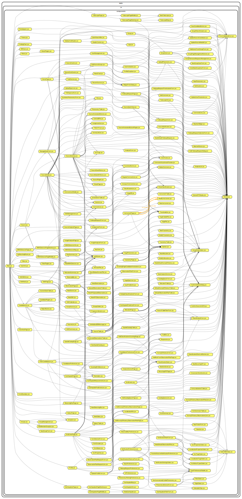

# Generating the component dependency tree :

To generate the graph we used the library Dependency-Cruiser, it automates the process of establishing the connections between the files

This graph was generated using dependency-cruiser version **12.10.0**

[dependency-cruiser tutorial](https://www.npmjs.com/package/dependency-cruiser)

This graph will need to be manually updated as the project advances
