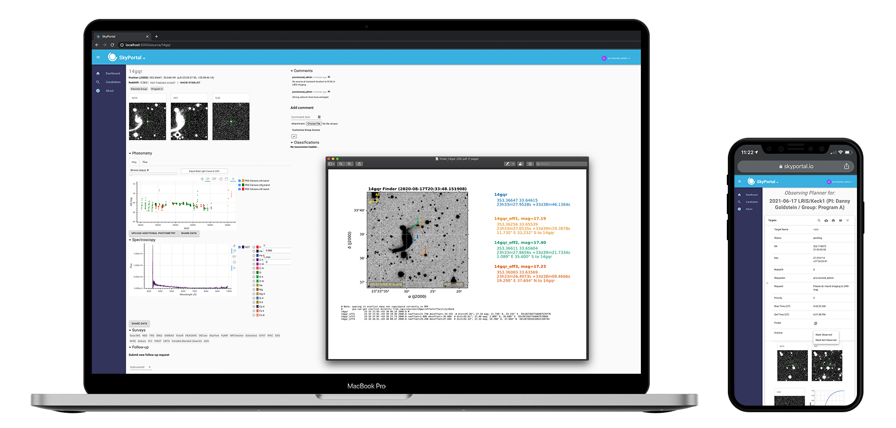

SkyPortal
---------

SkyPortal is a standalone, extensible, API-first web application that
can be used to serve public and/or private astronomical data on infrastructure
that you manage. Tired of managing observations of thousands of sources for
you and your group in Google Docs? Got a new astronomical survey you'd
like to serve to the public and don't want build and maintain a
website yourself? Want a place to manage requests for observations
during an upcoming observing run? Sometimes work in a mobile/tablet
environment? Then this project may be for you!

|github| |license| |joss|

.. |github| image:: https://img.shields.io/badge/GitHub-skyportal%2Fskyportal-blue
   :target: https://github.com/skyportal/skyportal

.. |license| image:: https://img.shields.io/badge/License-BSD%203--Clause-blue.svg
   :target: https://github.com/skyportal/skyportal/LICENSE.txt

.. |joss| image:: http://joss.theoj.org/papers/10.21105/joss.01247/status.svg
   :target: https://github.com/skyportal/skyportal/workflows/Test%20SkyPortal/badge.svg

SkyPortal is a fully open-source portal to manage and collaborate on
time-domain sources and events. On the backend, it has been designed
to ingest and store millions of events per night from disparate
discovery streams. The frontend allows searching by source properties,
source-level summary pages, synchronous and asynchronous source-level
communication, and group and user management.

By design SkyPortal makes use of hierarchical access control,
frontend/backend abstractions with strong API contracts, elastic
scaling, modern CI/CD practices, logging for auditability and
traceability, and documentation meant to foster extensibility. It is
built to run at the individual laptop level, in on-premise clusters,
or in the cloud. The initial use cases were developed in close
consultation with other time-domain practitioners and studying and
using proprietary portals.

Quick Start
-----------

To launch a demo instance of SkyPortal, first `clone the source code from
GitHub <https://github.com/skyportal/skyportal>`_:

.. code-block:: bash

  $ git clone --recurse-submodules git@github.com:skyportal/skyportal.git

then install the `system dependencies <./setup.html#dependencies>`_. If you haven't
already initialized the database, from the ``skyportal`` directory, run

.. code-block:: bash

  $ make db_init

Then start the app with

.. code-block:: bash

  $ make run

When the terminal shows ``Server at: http://localhost:5000``, open another
terminal, navigate to the ``skyportal`` directory, and run

.. code-block:: bash

  $ make load_demo_data

to populate the database with sample data. To access the running, populated
skyportal instance, log in as the admin user by navigating your browser to
``http://localhost:5000/become_user/1``. Then navigate to the home page at
``http://localhost:5000``.

User Guide
----------

.. toctree::
   :maxdepth: 1

   design
   setup
   usage
   api
   dev
   deploy
   data_loader
   contributing
   adding_features
   styling
   database
   migrations
   query_analysis
   permissions
   slack
   mma
   advanced_usage
   analysis

Contributing
------------

SkyPortal is released under the BSD license.  We encourage you to
modify it, reuse it, and contribute changes back for the benefit of
others.  We follow standard open source development practices: changes
are submitted as pull requests and, once they pass the test suite,
reviewed by the team before inclusion.  Please also see
`our contributing guide <./contributing.html>`_.

Acknowledgments
---------------
We thank the Gordon and Betty Moore Foundation for a
`Software SkyPortal grant <https://www.moore .org/grant-detail?grantId=GBMF9122>`_,
which partially covered the cost of the development of this project.

.. image:: https://www.moore.org/content/images/logo-light.png
   :target: https://www.moore.org/grant-detail?grantId=GBMF9122
   :alt: Moore Foundation Logo

.. Indices and tables
.. ==================

.. * :ref:`genindex`
.. * :ref:`modindex`
.. * :ref:`search`
