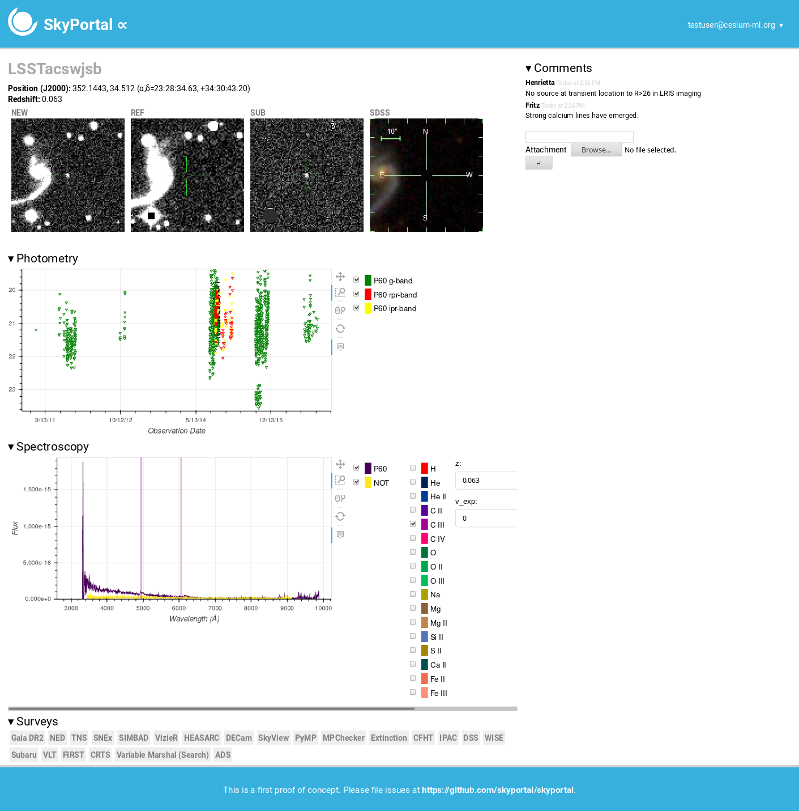

# Summary

SkyPortal is a web application that interactively displays
astronomical datasets for annotation, analysis, and discovery. It is
designed to be modular and extensible, so it can be customized for
various scientific use-cases.  It is released under the Modified BSD
license.

SkyPortal was designed with survey data from
the [Zwicky Transient Facility](https://www.ztf.caltech.edu), and
eventually
[The Large Synoptic Survey Telescope](https://www.lsst.org), in mind.

By default, it aims to provide a useful user experience, including
light curves, spectrograms, live chat, and links to other surveys.
But the intent, ultimately, is for the frontend to be modified to best
suit the specific scientific problem at hand.

# Architecture

SkyPortal builds on top
of [baselayer](https://github.com/cesium-ml/baselayer), a customizable
scientific web application platform developed by the same authors as
part of the Cesium-ML time-series project
[@brett_naul-proc-scipy-2016]. Baselayer provides SkyPortal with
authentication (via Google), websockets (to communicate between the
Python backend and the JavaScript frontend), and the scaffolding for
managing microservices and routing incoming requests via Nginx.

The application has a Python backend (running the Tornado web server),
with a React & Redux frontend.  React was chosen because of its clean
component design, and Redux provides the application logic that
renders these components appropriately, given the application state.

For machine users, SkyPortal provides a token-based API, meaning that
all of its data can be queried and modified by scripts without using
the browser frontend.

Importantly, the application is able to provide graphical renditions
of data-sets, using the [Bokeh](https://bokeh.pydata.org) library.  In
the default version of SkyPortal, this functionality is used to
render, e.g., spectrograms, with the ability to toggle color bands and
element spectra, or to adjust red-shift.

While not currently utilized, the platform also has the ability to do
distributed computation via [Dask](https://dask.org/).

SkyPortal implements two types of security: group based, and Access
Control List (ACL) based.  Group based security determines which users
have access to which sources (data objects), each of which is
associated with one or more group.  The members of these groups can be
changed by the adminstrator.  ACL based security deals with user
roles, which determine, regardless of data source, which pages a user
can access.

SkyPortal is designed to be employed on systems of varying scale: a
laptop, local server, or hosted infrastructure.  We support packaging
the entire application into a Docker container, which can then be
employed to the cloud .  An example deployment, using Kubernetes, is
provided.

Integration testing is done upon every commit, using Travis-CI, by
automating the Firefox browser
with
[GeckoDriver](https://firefox-source-docs.mozilla.org/testing/geckodriver/geckodriver/).
This ensures that the entire user experience—from logging in to making
API requests—keeps working correctly.

# Future work

In the next version of SkyPortal, we will support loading sources in
real-time from astronomical surveys, typically by
ingesting [Kafka](https://kafka.apache.org/) streams.  We are also
adding the ability to publish processed sub-streams, creating
so-called "brokers".  Finally, it will be possible to customize views
(from the web interface), and for developers to easily add and modify
user-interface components.

# Conclusion

SkyPortal is an exensible data platform for astronomy.  It is
currently being used to analyze data from various sky surveys, with
the potential to aid many more astronomers in their data processing
and visualization needs.  It is actively developed and maintained, and
the authors welcome & encourage collaboration.

# References
