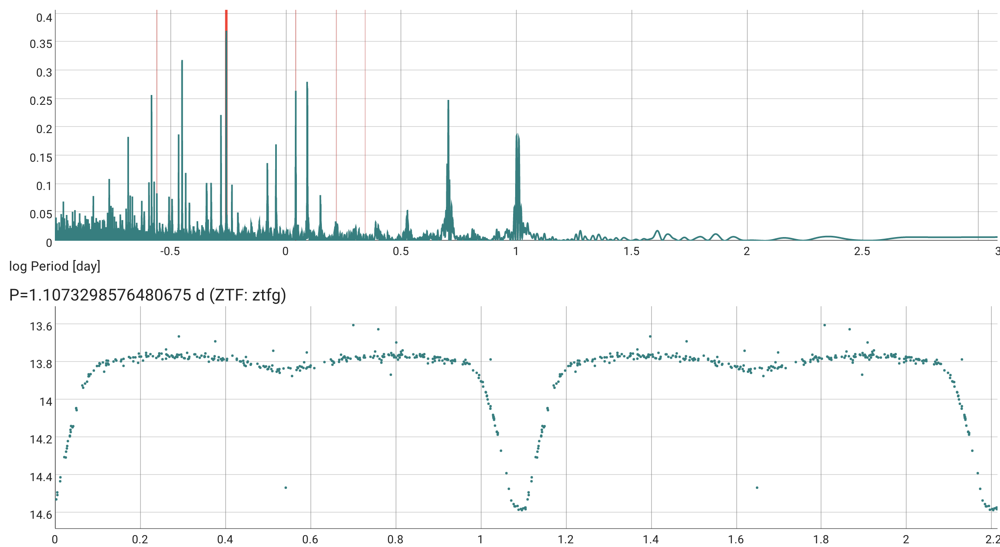

# Periodic Timeseries Features

Skyportal supports periodicity features. In particular, we provide a `Periodogram Analysis` button available from the `Source` page. This page allows for a dynamic, slider based period assignment and display.

The periods are saved as `Annotation`s, and the app searches for annotated periods with the keyword "period." Therefore, to add a period the app recognizes,  post an annotation with data: {'period': <value>} as an annotation (in units of days). The keyword for period can be capitalized or not. In the case of multiple annotations with periods posted, the most recent annotation is plotted. For those sources with this annotation, the `SourceTable` includes a phase-folded light curve on that period.
