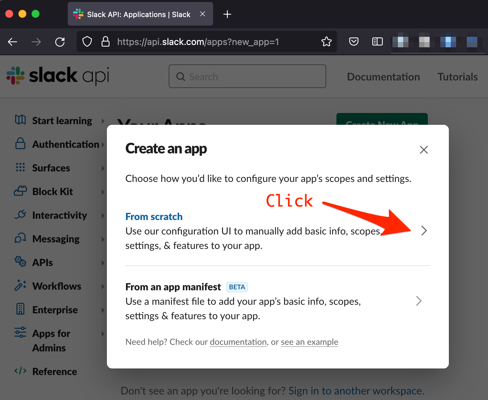
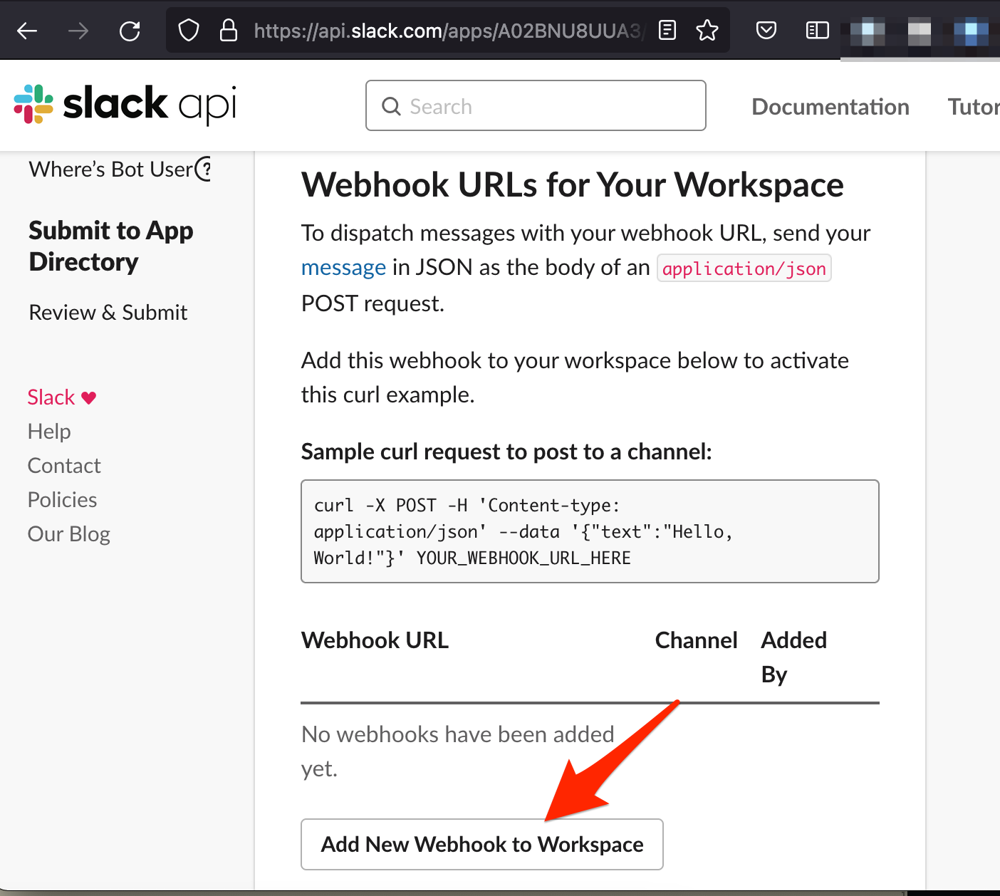
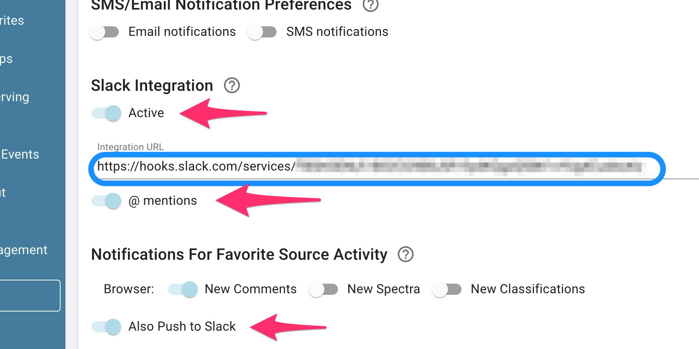
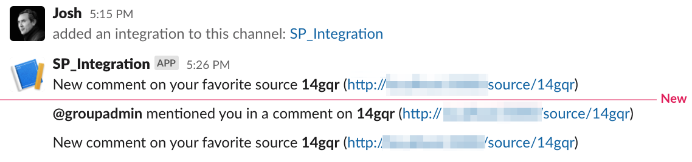

# Slack Integration

While the SkyPortal frontend already has real-time notifications for comment mentions and source updates in the browser, users may also wish to see these in Slack.

The Slack integration allows notifications for a given user to be mirrored to a Slack channel of choice. To set this up, the Slack workspace administrator generates a webhook URL (one per user/channel combination), and the user then adds that URL to their **Profile** page.

## Slack App Creation: One-time Admin Set Up

We first need to create a "Slack App" that acts as a conduit from SkyPortal to Slack. A logged in Slack Admin for a workspace should navigate to:

[https://api.slack.com/apps?new_app=1](https://api.slack.com/apps?new_app=1)

Then click on the "From Scratch" section to start the App building process:

The Slack admin then creates a name for the application (like `SP_integration`) and creates the app in the desired workspace:

After the app is created, click on `Incoming Webhooks` in the left-side menu and then activate webhooks with the toggle on the top right:

## Connecting SkyPortal Users to Slack

### Slack Admin Steps

For each user in Slack who wishes to connect to their SkyPortal notifications, the Slack admin will return to the `Incoming Webhooks` portion of the Slack app and then click on `Add New Webhook to Workspace`:

In the popup dialog choose the Slack direct messages channel for that user and copy the new Webhook URL:

Anyone with this webhook URL will be able to post messages into the specified Channel (in the example above, `#Josh`). Provide this URL to the user.

### SkyPortal User Steps

The SkyPortal user then navigates to their **Profile** page and enables Slack Notifications. They enter the unique Webhook URL generated by the Slack admin into the Slack Integration URL form (circled in blue below):

If the `@ mentions` toggle is activated, then all mentions of this user on SkyPortal will be sent to the Slack channel associated with the webhook. Likewise, if `Also Push to Slack` is enabled, then all enabled Favorite Source Activity types for the Browser will also be sent to Slack:

For the SkyPortal user to stop Slack notifications, they only need to toggle off the Slack Integration button in the **Profile** page.

## Notes on Reliability and Security

Unlike a fault-tolerant pub-sub mechanism like XMPP Jabber, Slack notifications are not guaranteed to be delivered. If any part of the communication fails (e.g., Slack downtime or SkyPortal errors), the Slack messaging will not work. Users should not rely upon receiving Slack messages to perform mission critical work.

The Slack Admin is trusted to verify that the SkyPortal user they send a Webhook URL to is the same person (or entity) represented in their Slack Workspace.  For most use cases this is a reasonable measure to keep SkyPortal data secure. In addition, while the names and URLs of sources are shown in Slack, no other information (such as comments or classification results) is transmitted. So even if identities are mismatched or channels are compromised, a Slack user with unauthorized access will not be able to access substantive information in SkyPortal.

The Slack admin may delete the Slack App for their workspace at any time, invalidating all webhooks.
