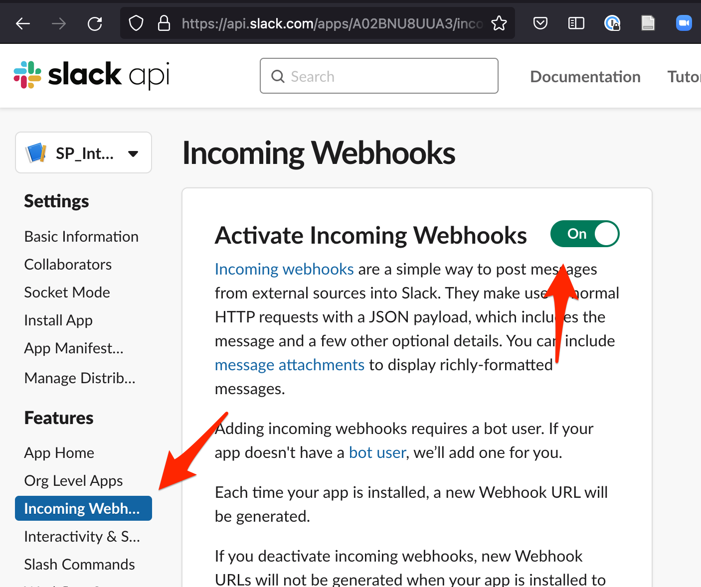
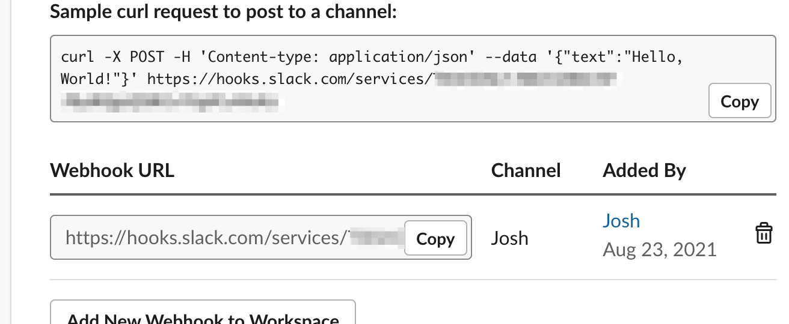

# Slack Integration

While the SkyPortal frontend has several real-time interactions, such as with conversations using Comments and browser notifications, users may wish to receive some notifications in Slack.

A Slack integration will allow SkyPortal notifications for individual users to be mirrored to a certain Slack channel for that individual. The basic idea is that someone with admin privileges in a Slack workspace will add a webhook for each SkyPortal user to a certain Slack channel. Each SkyPortal user then adds that webhook URL to their **Profile** page.

## Slack App Creation: One-time Admin Set Up

We first need to create a "Slack App" that acts as a conduit from SkyPortal to Slack. A logged in Slack Admin for a workspace should navigate to:

[https://api.slack.com/apps?new_app=1](https://api.slack.com/apps?new_app=1)

Then click on the "From Scratch" section to start the App building process:

The Slack admin then creates a name for the application (like `SP_integration`) and creates the app in the desired workspace:

After the app is created, click on `Incoming Webhooks` in the left-side menu and then activate webhooks with the toggle on the top right:

## Connecting SkyPortal Users to Slack

### Slack Admin Steps

For each user in Slack who wishes to connect to their SkyPortal notifications, the Slack admin will return to the `Incoming Webhooks` portion of the Slack app, then clicking on `Add New Webhook to Workspace`:

In the popup dialog choose the Slack channel for that user and copy the new Webhook URL:

Anyone with this webhook URL will be able to post messages into the specified Channel (in the example above, `#Josh`). Send this URL to the user (e.g., via Slack).

### SkyPortal User Steps

The SkyPortal user will then log into their SkyPortal account, navigate to their **Profile** page, and then enable Slack Notifications. With the unique Webhook URL generated by the Slack admin, the SkyPortal user then enters that into the Slack Integration URL form (circled in blue below):

If the `@ mentions` toggle is activated, then all mentions of this SkyPortal user will be sent to the Slack account associated with the webhook. Likewise, if the `Also Push to Slack` toggle is activated, then all enabled Favorite Source Activity types for the Browser will also be sent to Slack:

If the SkyPortal users decides to inactivate the Slack integration, they only need to toggle off the Slack Integration button in the **Profile** page.

## Notes on Reliability and Security

Unlike a fault-tolerant pub-sub mechanism like XMPP Jabber, Slack notifications are not guaranteed to eventually arrive. If any part of the communications are not working (e.g., Slack downtime or SkyPortal errors), the Slack messaging will not work. Users should not rely upon receiving Slack messages to perform mission critical work.

There is an inherent trust placed in the Slack Admin that the person they send the Webhook URL to is the same person (or entity) represented in the Slack Workspace they administer.  For most use cases this serves as a reasonable approach to keep both Slack and SkyPortal information secure. Even so, while the names of the sources are shown in Slack, along with links to those sources, no other information is transmitted to Slack (like the comments themselves or classification results). So even in the case that the identities are breached, a Slack user with unauthorized access will not be able to access substantive information in SkyPortal.

The Slack admin may delete the Slack App for that workspace at anytime, invalidating the individual webbooks.
